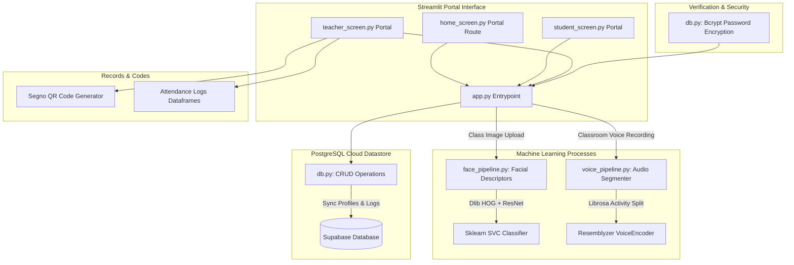
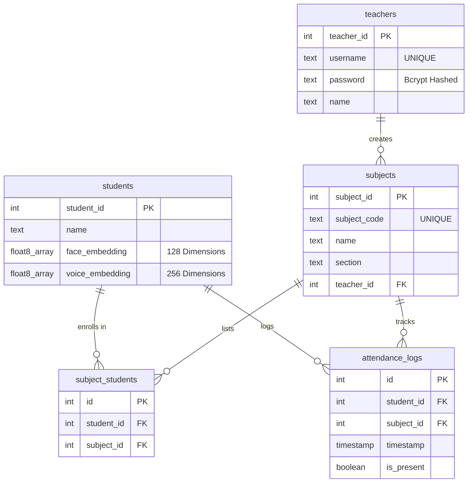
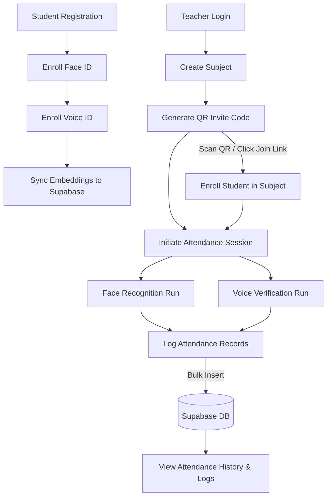

# SnapClass


SnapClass is a biometrics-based student check-in portal. By integrating **face recognition** and **voice biometrics**, the system automates classroom attendance logging in seconds, removing manual rosters and mitigating proxy attendance.

---

## 📌 Project Highlights

*   **Multi-Modal AI Engine:** Combines facial recognition matching and voice verification pipelines.
*   **On-the-Fly ML Classification:** Dynamically trains a Support Vector Machine (SVM) on active classroom rosters for fast matching.
*   **Vector Database Storage:** Employs Supabase PostgreSQL to store high-dimensional facial and speech embeddings.
*   **QR-Code Course Enrollment:** Uses Segno to generate unique QR course invites that instantly link student profiles to rosters.
*   **Production Sandbox Container:** Dockerized environment for quick local execution, encapsulating complex compilation headers.
*   **Test Suite Framework:** Unit and integration test suites running Pytest validation checks on AI models.

---

## 🏗️ System Architecture




---

## 🧠 AI Pipeline Workflows

### 1. Student Biometrics Registration
1.  **Face Embeddings:** The student uploads/captures a portrait. `dlib.get_frontal_face_detector` localizes the face bounding boxes, and `dlib.face_recognition_model_v1` outputs a **128-dimensional facial representation vector**.
2.  **Voice Embeddings:** The student records a short vocal phrase. The audio stream is downsampled to 16,000 Hz, and the `VoiceEncoder` (Resemblyzer) computes a **256-dimensional speech d-vector embedding**.
3.  **Database Synced:** The vectors are stored in the student's Supabase cloud database record.

### 2. Live Classroom Verification
*   **Face ID Run:** The instructor uploads a classroom photo. The pipeline extracts 128d face vectors from all detected faces. It queries enrolled student templates, trains a scikit-learn `SVC(kernel='linear')` classifier on-the-fly, and outputs predicted student IDs. Predictions are only saved if the Euclidean distance to the matched template is $\le 0.6$.
*   **Voice ID Run:** The instructor records sequential classroom responses. `librosa.effects.split` segments the audio by active speech intervals (silence threshold: `top_db=30`). The pipeline generates a 256d embedding for each segment and uses a cosine similarity checker (`np.dot`) to verify student identity (match threshold $\ge 0.65$).

---

## 🛠️ Technology Stack

| Component | Technical Implementation |
| --- | --- |
| **Language** | Python 3.10 |
| **Frontend Portal** | Streamlit |
| **Database** | Supabase Cloud (PostgreSQL Vector mapping) |
| **Biometric Engines** | Dlib (128d face vectors), Resemblyzer (256d speaker d-vectors) |
| **Audio Processing** | Librosa (Signal downsampling and voice split extraction) |
| **Machine Learning** | Scikit-learn (Linear SVM classification model) |
| **Packaging** | Docker (Multi-stage compilation container) |
| **Quality Control** | Pytest, Flake8 |

---

## 📁 Folder Structure

```text
Snapclass/
├── docs/
│   └── architecture/          # System architecture diagrams
├── tests/                     # Pytest suite files
├── src/
│   ├── components/            # Shared UI dialogs and modals
│   ├── database/              # Supabase connections and query handlers
│   ├── pipelines/             # Dlib Face ID and Resemblyzer Voice ID pipelines
│   └── screens/               # Main Streamlit screen routes
├── app.py                     # Streamlit application entrypoint
├── Dockerfile                 # Multi-stage production container configuration
└── requirements.txt           # Pinned dependency packages
```

---

## ⚙️ Setup & Local Execution

### Prerequisites
*   **Python:** Version 3.10 (Strictly required for `resemblyzer` dependency compatibility).
*   **C++ Compilers:** Required to build native `dlib` binaries (Visual Studio for Windows; CMake for macOS/Linux).

### Installation
1.  **Clone Project:**
    ```bash
    git clone https://github.com/your-username/snapclass.git
    cd snapclass
    ```
2.  **Install Requirements:**
    ```bash
    python -m venv venv
    # Activate:
    # Windows: venv\Scripts\activate | macOS/Linux: source venv/bin/activate
    pip install -r requirements.txt
    ```
3.  **Cloud Settings:**
    Add your Supabase endpoint values inside `.streamlit/secrets.toml`:
    ```toml
    SUPABASE_URL = "https://your-project.supabase.co"
    SUPABASE_KEY = "your-supabase-anon-key"
    ```

### Run Locally
```bash
streamlit run app.py
```

---

## 🗄️ Database Design

### Why Supabase is Used
Supabase is used as a serverless backend provider, allowing the Streamlit application to securely query and write to a hosted PostgreSQL instance without requiring a custom intermediary web server or custom REST APIs.

### Database Architecture
The relational database schema is structured as follows:



*   **teachers**: Stores credential data (username and Bcrypt-salted passwords).
*   **students**: Stores student profiles alongside nullable floating point array fields for biometric embeddings.
*   **subjects**: Stores class registration information and maps each subject to a creator teacher.
*   **subject_students**: Junction table handling course enrollments.
*   **attendance_logs**: Log transactional records showing which student was present or absent for a class at a given timestamp.

### Biometric Embeddings Storage
Face and voice templates are computed locally using Dlib (128-dimensional array) and Resemblyzer (256-dimensional array). These high-dimensional features are saved in PostgreSQL columns defined as variable-length float arrays (`FLOAT8[]`), enabling direct vector query comparisons.

### Attendance Record Generation
Attendance runs generate presence logs as arrays of dictionaries (containing `student_id`, `subject_id`, `timestamp`, and `is_present` boolean values). These logs are bulk-inserted in a single transaction database call to minimize latency.

---

## 🔄 Project Workflow

The application workflow handles enrollment and multi-modal biometric check-ins as follows:



### End-to-End Execution Sequence
1.  **Teacher Onboarding & Class Creation:** The teacher logs in, creates a subject, and generates a course join code QR invite link.
2.  **Student Registration & Embedding Sync:** The student registers their face and voice samples. The systems calculate biometric embeddings and upload them to Supabase.
3.  **Enrollment:** The student scans the QR code or clicks the join link, which associates their student record with the subject.
4.  **Verification session:** During class, the teacher initiates an attendance session:
    *   **Face Check:** The teacher uploads a classroom photograph. Faces are localized and compared against enrolled templates using a dynamic SVM classifier.
    *   **Voice Check:** The teacher records sequential check-ins. The system splits the audio by silence ranges and matches the vocal vectors using cosine similarity check-ins.
5.  **Logging & History:** The calculated attendance outcomes are batched and written into the PostgreSQL logs, making records instantly viewable under the history tabs.

---

## 📄 License & Author
Licensed under the [MIT License](LICENSE).  
Developed by your name. Connect with me on [GitHub](https://github.com/your-username) and [LinkedIn](https://linkedin.com/in/your-profile).