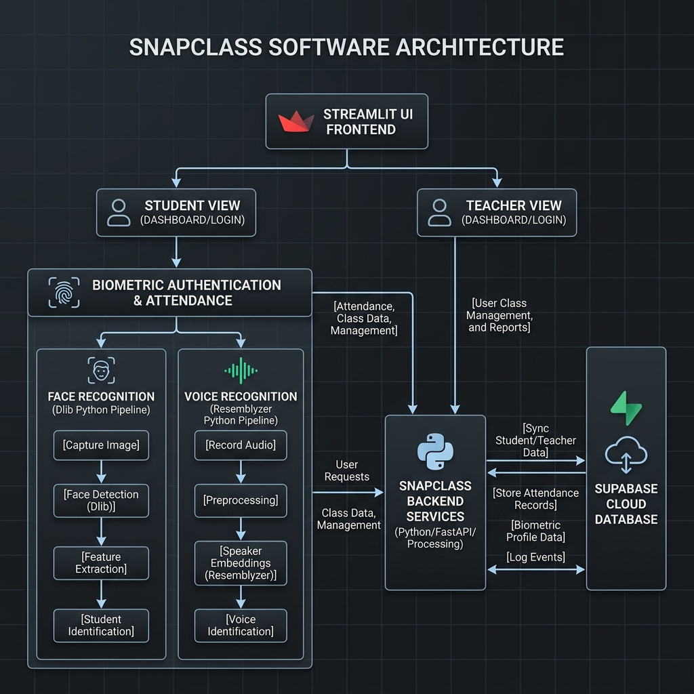
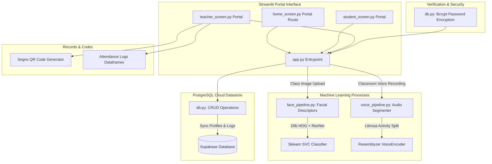

# SnapClass


SnapClass is a biometrics-based student check-in portal. By integrating **face recognition** and **voice biometrics**, the system automates classroom attendance logging in seconds, removing manual rosters and mitigating proxy attendance.

---

## 📌 Project Highlights

*   **Multi-Modal AI Engine:** Combines facial recognition matching and voice verification pipelines.
*   **On-the-Fly ML Classification:** Dynamically trains a Support Vector Machine (SVM) on active classroom rosters for fast matching.
*   **Vector Database Storage:** Employs Supabase PostgreSQL to store high-dimensional facial and speech embeddings.
*   **QR-Code Course Enrollment:** Uses Segno to generate unique QR course invites that instantly link student profiles to rosters.
*   **Production Sandbox Container:** Dockerized environment for quick local execution, encapsulating complex compilation headers.
*   **Test Suite Framework:** Unit and integration test suites running Pytest validation checks on AI models.

---

## 🏗️ System Architecture





---

## 🧠 AI Pipeline Workflows

### 1. Student Biometrics Registration
1.  **Face Embeddings:** The student uploads/captures a portrait. `dlib.get_frontal_face_detector` localizes the face bounding boxes, and `dlib.face_recognition_model_v1` outputs a **128-dimensional facial representation vector**.
2.  **Voice Embeddings:** The student records a short vocal phrase. The audio stream is downsampled to 16,000 Hz, and the `VoiceEncoder` (Resemblyzer) computes a **256-dimensional speech d-vector embedding**.
3.  **Database Synced:** The vectors are stored in the student's Supabase cloud database record.

### 2. Live Classroom Verification
*   **Face ID Run:** The instructor uploads a classroom photo. The pipeline extracts 128d face vectors from all detected faces. It queries enrolled student templates, trains a scikit-learn `SVC(kernel='linear')` classifier on-the-fly, and outputs predicted student IDs. Predictions are only saved if the Euclidean distance to the matched template is $\le 0.6$.
*   **Voice ID Run:** The instructor records sequential classroom responses. `librosa.effects.split` segments the audio by active speech intervals (silence threshold: `top_db=30`). The pipeline generates a 256d embedding for each segment and uses a cosine similarity checker (`np.dot`) to verify student identity (match threshold $\ge 0.65$).

---

## 🛠️ Technology Stack

| Component | Technical Implementation |
| --- | --- |
| **Language** | Python 3.10 |
| **Frontend Portal** | Streamlit |
| **Database** | Supabase Cloud (PostgreSQL Vector mapping) |
| **Biometric Engines** | Dlib (128d face vectors), Resemblyzer (256d speaker d-vectors) |
| **Audio Processing** | Librosa (Signal downsampling and voice split extraction) |
| **Machine Learning** | Scikit-learn (Linear SVM classification model) |
| **Packaging** | Docker (Multi-stage compilation container) |
| **Quality Control** | Pytest, Flake8 |

---

## 📁 Folder Structure

```text
Snapclass/
├── docs/
│   └── architecture/          # Architecture visuals (architecture.png)
├── tests/
│   ├── test_face_pipeline.py  # Mock test cases for face matcher
│   └── test_voice_pipeline.py # Unit tests for speech math algorithms
├── src/
│   ├── components/            # Shared UI dialogs, widgets, and cards
│   ├── database/              # Supabase connections and database CRUD
│   ├── pipelines/             # Core Face & Voice biometrics pipelines
│   ├── screens/               # Screen routing (Home, Student, Teacher)
│   └── ui/                    # Base UI and CSS layout custom styles
├── app.py                     # Portal entrypoint
├── Dockerfile                 # Multi-stage Docker deployment config
├── LICENSE                    # MIT open-source license
├── PROJECT_SUMMARY.md         # Technical interview prep guide
├── requirements.txt           # Dependency pinning
└── .gitignore                 # Git ignore patterns
```

---

## ⚙️ Setup & Local Execution

### Prerequisites
*   **Python:** Version 3.10 (Strictly required for `resemblyzer` dependency compatibility).
*   **C++ Compilers:** Required to build native `dlib` binaries (Visual Studio for Windows; CMake for macOS/Linux).

### Installation
1.  **Clone Project:**
    ```bash
    git clone https://github.com/your-username/snapclass.git
    cd snapclass
    ```
2.  **Install Requirements:**
    ```bash
    python -m venv venv
    # Activate:
    # Windows: venv\Scripts\activate | macOS/Linux: source venv/bin/activate
    pip install -r requirements.txt
    ```
3.  **Cloud Settings:**
    Add your Supabase endpoint values inside `.streamlit/secrets.toml`:
    ```toml
    SUPABASE_URL = "https://your-project.supabase.co"
    SUPABASE_KEY = "your-supabase-anon-key"
    ```

### Run Locally
```bash
streamlit run app.py
```

---

## 🚀 Why This Project Stands Out (Recruiter Corner)

*   **Decoupled AI Architecture:** Separating computationally heavy biometric pipelines from UI layers keeps portal execution responsive.
*   **On-the-Fly ML Classifier:** Rather than matching static image lists, the portal dynamically trains a Support Vector Machine on active classroom structures, optimizing multi-student prediction accuracy.
*   **Real-world Digital Signal Processing:** Employs Librosa to split overlapping audio recordings by speech energy intervals, isolating individual student audio clips.
*   **Cloud Vector Database:** Uses Supabase database tables to model users, course mappings, and high-dimensional vector profiles.

---

## 🖼️ Screenshots & Demos
*(Screenshots can be added locally under a `docs/screenshots/` folder if desired)*

### 1. Recommended Capture Guide (5 Screenshots)
1.  **Home Screen Portal (`docs/screenshots/home.png`):** Selection dashboard showing clean student/teacher login panels.
2.  **Student Registration (`docs/screenshots/registration.png`):** Camera input widget and audio input analyzer showing face/voice enrolment.
3.  **Teacher Course Hub (`docs/screenshots/teacher_hub.png`):** Portal view showing course cards, student counts, and active verification buttons.
4.  **QR Code Course Share (`docs/screenshots/qr_invite.png`):** Join dialog showing the generated QR code and copyable URL link.
5.  **Attendance Results Log (`docs/screenshots/attendance_log.png`):** Historical table output listing present student count percentages.

### 2. Recommended Walkthrough GIF Flow (30–45 Seconds)
*(Place file at `docs/screenshots/demo.gif`)*
*   **0:00 - 0:10:** Student registers visual face profile and records a voice verification clip.
*   **0:10 - 0:20:** Teacher logs in, creates a subject, and generates the course QR invitation.
*   **0:20 - 0:35:** Teacher launches Face ID check-in, uploads classroom group photo, and views recognized student tags.
*   **0:35 - 0:45:** Teacher logs voice check-ins by recording class audio, showing the real-time student match list.

---

## 📄 License & Author
Licensed under the [MIT License](LICENSE).  
Developed by your name. Connect with me on [GitHub](https://github.com/your-username) and [LinkedIn](https://linkedin.com/in/your-profile).