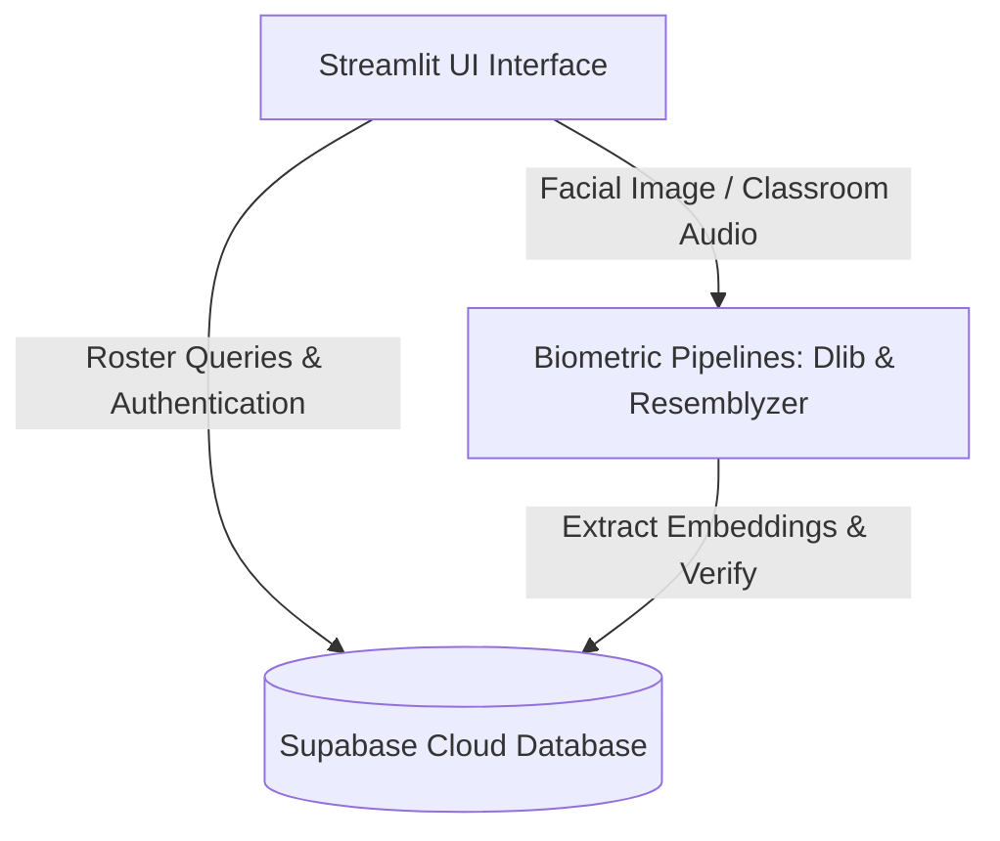
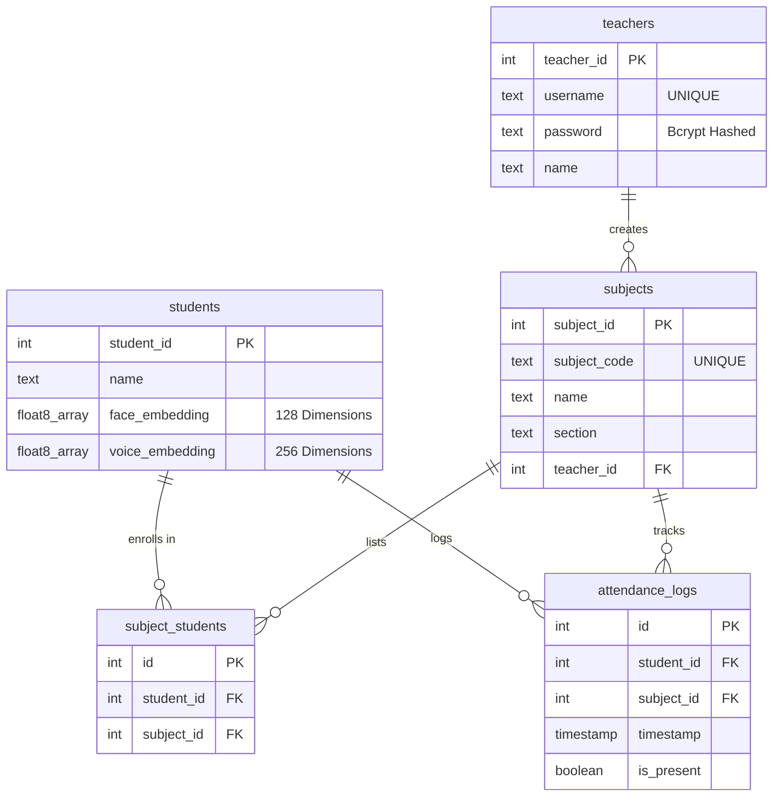
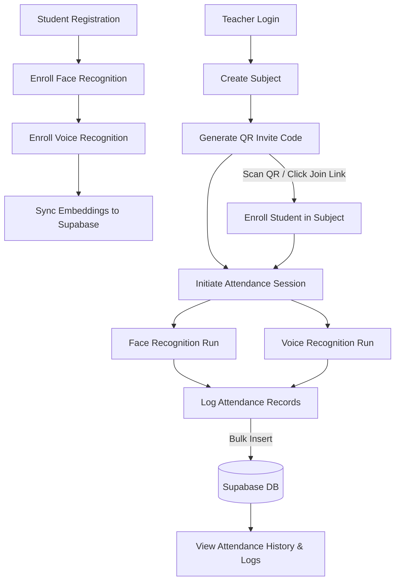

# SnapClass


SnapClass is a biometrics-based student check-in portal designed to automate attendance logging. Traditional systems like roll-calls or paper sign-in sheets are time-consuming and vulnerable to proxy attendance ("buddy-punching"). This project offers a secure, multi-modal biometric solution combining face recognition and voice ID biometrics to log presence in seconds, directly synchronizing records with a PostgreSQL cloud database.

---

## 📋 Table of Contents
1. [Core Features](#-core-features)
2. [Project Objectives](#-project-objectives)
3. [System Architecture](#-system-architecture)
4. [AI Pipeline Workflows](#-ai-pipeline-workflows)
5. [Technology Stack](#-technology-stack)
6. [Folder Structure](#-folder-structure)
7. [Setup & Local Execution](#-setup--local-execution)
8. [Database Design](#-database-design)
9. [Project Workflow](#-project-workflow)
10. [Challenges & Solutions](#-challenges--solutions)
11. [Future Enhancements](#-future-enhancements)
12. [License & Author](#-license--author)

---

## 📌 Core Features

*   **Multi-Modal AI Engine:** Integrates both facial recognition and voice verification pipelines for robust biometrics check-ins.
*   **On-the-Fly ML Classification:** Dynamically trains a Support Vector Machine (SVM) on active classroom rosters to match students in group photos.
*   **Vector Database Storage:** Stores high-dimensional biometric vectors directly inside a serverless PostgreSQL database.
*   **QR-Code Course Enrollment:** Generates scannable QR invites to enroll students in subjects without manual data entry.
*   **Dockerized Environment:** Simplifies dependency setup for compilation libraries like Dlib.
*   **Test Suite Framework:** Includes pre-configured test coverage verification checks for the machine learning pipelines.

---

## 🎯 Project Objectives

*   **Eliminate Manual Attendance:** Replace paper sheets and verbal roll-calls with fast biometric capture.
*   **Reduce Proxy Attendance:** Restrict check-in fraud using unique facial descriptors and voice embedding validation.
*   **Automate Student Verification:** Identify present students from classroom photographs or vocal audio recordings.
*   **Simplify Student Enrollment:** Streamline registration using QR code and link mapping tables.
*   **Maintain Attendance History:** Sync and log time-stamped attendance data in a relational PostgreSQL cloud datastore.

---

## 🏗️ System Architecture




---

## 🧠 AI Pipeline Workflows

### 1. Student Biometrics Registration
1.  **Face Embeddings:** The student uploads/captures a portrait. `dlib.get_frontal_face_detector` localizes the face bounding boxes, and `dlib.face_recognition_model_v1` outputs a **128-dimensional facial representation vector**.
2.  **Voice Embeddings:** The student records a short vocal phrase. The audio stream is downsampled to 16,000 Hz, and the `VoiceEncoder` (Resemblyzer) computes a **256-dimensional speech d-vector embedding**.
3.  **Database Synced:** The vectors are stored in the student's Supabase cloud database record.

### 2. Live Classroom Verification
*   **Face Recognition Run:** The instructor uploads a classroom photo. The pipeline extracts 128d face vectors from all detected faces. It queries enrolled student templates, trains a scikit-learn `SVC(kernel='linear')` classifier on-the-fly, and outputs predicted student IDs. Predictions are only saved if the Euclidean distance to the matched template is $\le 0.6$.
*   **Voice Recognition Run:** The instructor records sequential classroom responses. `librosa.effects.split` segments the audio by active speech intervals (silence threshold: `top_db=30`). The pipeline generates a 256d embedding for each segment and uses a cosine similarity checker (`np.dot`) to perform voice recognition matching (threshold $\ge 0.65$).

---

## 🛠️ Technology Stack

| Component | Technical Implementation |
| --- | --- |
| **Language** | Python 3.10 |
| **Frontend Portal** | Streamlit |
| **Authentication** | Bcrypt password encryption |
| **QR Code Generation** | Segno library |
| **Database** | Supabase Cloud (Serverless PostgreSQL) |
| **Database Driver** | `supabase-py` client library |
| **Computer Vision** | Dlib frontal face detector & ResNet v1 facial feature extractor |
| **Audio Processing** | Librosa (Audio downsampling and signal activity splitting) |
| **Biometric Engines** | Dlib (128d face descriptors), Resemblyzer (256d speaker d-vectors) |
| **Machine Learning** | Scikit-learn (Linear SVM classification model) |
| **Packaging** | Docker (Multi-stage compilation container) |
| **Quality Control** | Pytest unit tests, Flake8 code linting |

---

## 🏗️ Project Structure

SnapClass is structured as a modular Streamlit application with decoupled components:
*   **Presentation Layer (`src/screens/` & `src/components/`):** Streamlit views, course dashboards, modal dialogues, and custom base CSS layouts.
*   **Machine Learning Pipelines (`src/pipelines/`):** Independent processors handling face detection, face embedding extraction, dynamic SVM training, audio segmentation, and speech d-vector embeddings.
*   **Data Tier (`src/database/`):** Cloud connection configurations and transactional PostgreSQL queries using the Supabase client.

---

## 📁 Folder Structure

```text
SnapClass/
├── docs/
│   └── architecture/          # System architecture diagrams
├── tests/                     # Pytest suite files
├── src/
│   ├── components/            # Shared UI dialogs and modals
│   ├── database/              # Supabase connections and query handlers
│   ├── pipelines/             # Dlib Face ID and Resemblyzer Voice ID pipelines
│   └── screens/               # Main Streamlit screen routes
├── app.py                     # Streamlit application entrypoint
├── Dockerfile                 # Multi-stage production container configuration
└── requirements.txt           # Pinned dependency packages
```

---

## ⚙️ Setup & Local Execution

### Prerequisites
*   **Python:** Version 3.10 (Recommended for compatibility with Resemblyzer.)
*   **C++ Compilers:** Required to build native `dlib` binaries (Visual Studio for Windows; CMake for macOS/Linux).

### Installation
1.  **Clone Project:**
    ```bash
    git clone https://github.com/your-username/snapclass.git
    cd snapclass
    ```
2.  **Install Requirements:**
    ```bash
    python -m venv venv
    # Activate:
    # Windows: venv\Scripts\activate | macOS/Linux: source venv/bin/activate
    pip install -r requirements.txt
    ```
3.  **Local Environment Configurations:**
    *   **Environment Variables:** Create a `.env` file in the root directory for general parameters:
        ```bash
        SUPABASE_URL=https://your-project-id.supabase.co
        SUPABASE_KEY=your-supabase-anon-key
        ```
    *   **Streamlit Secrets:** Streamlit relies on `.streamlit/secrets.toml` for local secure variables:
        ```toml
        SUPABASE_URL = "https://your-project.supabase.co"
        SUPABASE_KEY = "your-supabase-anon-key"
        ```

### Run Locally
```bash
streamlit run app.py
```

---

## 🗄️ Database Design

### Why Supabase is Used
Supabase is used as a serverless backend provider, allowing the Streamlit application to securely query and write to a hosted PostgreSQL instance without requiring a custom intermediary web server or custom REST APIs.

### Database Architecture
The relational database schema is structured as follows:



*   **teachers**: Stores credential data (username and Bcrypt-salted passwords).
*   **students**: Stores student profiles alongside nullable floating point array fields for biometric embeddings.
*   **subjects**: Stores class registration information and maps each subject to a creator teacher.
*   **subject_students**: Junction table handling course enrollments.
*   **attendance_logs**: Log transactional records showing which student was present or absent for a class at a given timestamp.

### Biometric Embeddings Storage
Face and voice templates are computed locally using Dlib (128-dimensional array) and Resemblyzer (256-dimensional array). These high-dimensional features are saved in PostgreSQL columns defined as variable-length float arrays (`FLOAT8[]`), enabling direct vector query comparisons.

### Attendance Record Generation
Attendance runs generate presence logs as arrays of dictionaries (containing `student_id`, `subject_id`, `timestamp`, and `is_present` boolean values). These logs are bulk-inserted in a single transaction database call to minimize latency.

---

## 🔄 Project Workflow

The application workflow handles enrollment and multi-modal biometric check-ins as follows:



### End-to-End Execution Sequence
1.  **Teacher Onboarding & Class Creation:** The teacher logs in, creates a subject, and generates a course join code QR invite link.
2.  **Student Registration & Embedding Sync:** The student registers their face and voice samples. The systems calculate biometric embeddings and upload them to Supabase.
3.  **Enrollment:** The student scans the QR code or clicks the join link, which associates their student record with the subject.
4.  **Verification session:** During class, the teacher initiates an attendance session:
    *   **Face Check:** The teacher uploads a classroom photograph. Faces are localized and compared against enrolled templates using a dynamic SVM classifier.
    *   **Voice Check:** The teacher records sequential check-ins. The system splits the audio by silence ranges and matches the vocal vectors using cosine similarity check-ins.
5.  **Logging & History:** The calculated attendance outcomes are batched and written into the PostgreSQL logs, making records instantly viewable under the history tabs.

## 🛠️ Challenges & Solutions

*   **Multiple Face Recognition in Group Photos:** Identifying multiple students in a single group photograph can fail due to angle and illumination variations.
    *   *Solution:* Localized face windows using Dlib HOG frontal detectors and aligned them using shape predictors. We then trained an SVM classifier on-the-fly inside Streamlit using active student templates, bounding face predictions with a Euclidean similarity threshold ($\le 0.6$).
*   **Voice Segmentation in Classroom Audio:** Continuous audio recorded in classrooms contains noise, silence, and background chatter.
    *   *Solution:* Used `librosa.effects.split` to segment continuous audio into separate spoken utterances based on amplitude thresholds, rejecting segments shorter than 0.5 seconds before computing vocal d-vectors.
*   **High-Dimensional Biometric Matching:** Comparing face (128d) and voice (256d) vectors across high volumes of database entries introduces latency.
    *   *Solution:* Cached biometric models in memory using `@st.cache_resource` decorators. Stored embeddings in Postgres `FLOAT8[]` array columns, allowing high-speed mathematical matrix comparisons.
*   **Attendance Logging Overhead:** Row-by-row logging queries bottleneck transaction limits.
    *   *Solution:* Attendance records are batch-mapped to database schemas in client memory and committed using a single bulk insert transaction to Supabase.
*   **Database Synchronization:** Managing direct secure database calls from client Streamlit instances without exposed passwords.
    *   *Solution:* Integrated serverless `supabase-py` clients powered by Streamlit Secrets (stored in `.streamlit/secrets.toml` locally and encrypted cloud variables in production).

---

## ⚠️ Current Limitations

*   **Dynamic SVM Retraining Overhead:** Because the SVM classifier trains dynamically in memory during Face Recognition, verification latency scales with larger classes.
*   **Minimum Student Registration Constraint:** At least two registered student profiles are required to train the linear SVM classifier. For single-student classes, the pipeline falls back to Euclidean distance checks.
*   **Environment Noises in Audio Capture:** Voice Recognition splits continuous audio by silence thresholds, but does not currently handle overlapping speech or noisy environment audio filtering.

---

## 🔮 Future Enhancements

*   **Motion Liveness Detection:** Integrate blink and facial motion checks using OpenCV to prevent paper/screen photo spoofing.
*   **Roster Exporting:** Provide automated exports of attendance records to PDF and Excel spreadsheets directly from the teacher dashboard.
*   **Multi-Class Scheduling:** Add calendar schedules to restrict attendance logs to active course hours.

---

## 👨‍💻 Author

### Aadil Shaikh

*   **GitHub:** [skaadil9172](https://github.com/skaadil9172)
*   **LinkedIn:** [aadil-shaikh-a4080a253](https://linkedin.com/in/aadil-shaikh-a4080a253)